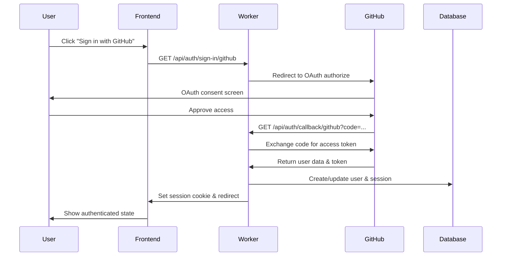

# Architecture Guide

Comprehensive guide to the project structure, authentication system, and API design.

## Project Structure

```
├── src/                       # React SPA Frontend
│   ├── components/            # React components
│   │   ├── ApiStatus.tsx      # API connection status
│   │   ├── CommentForm.tsx    # Comment creation form
│   │   ├── CommentList.tsx    # Comments display
│   │   ├── Navigation.tsx     # Auth navigation component
│   │   ├── UserForm.tsx       # User creation form
│   │   └── UserList.tsx       # Users display
│   ├── lib/
│   │   └── auth.ts           # Better Auth React client
│   ├── api.ts                # Frontend API client
│   ├── types.ts              # Shared TypeScript types
│   ├── App.tsx               # Main React component
│   └── main.tsx              # React entry point
│
├── worker/                    # Cloudflare Worker Backend
│   ├── src/
│   │   ├── db/
│   │   │   ├── auth.ts       # Better Auth database schema (generated)
│   │   │   ├── schema.ts     # Drizzle database schema
│   │   │   └── utils.ts      # Database utilities
│   │   ├── dtos/
│   │   │   └── index.ts      # Zod validation schemas and OpenAPI types
│   │   ├── lib/
│   │   │   └── auth.ts       # Better Auth server configuration
│   │   ├── middleware/
│   │   │   ├── auth.ts       # Authentication middleware
│   │   │   ├── dbProvider.ts # Database connection middleware
│   │   │   └── validator.ts  # Request validation middleware
│   │   ├── utils/
│   │   │   └── allow-list.ts # User access control (optional)
│   │   └── index.ts          # Main Hono application with routes
│   ├── tests/                # Test files
│   │   ├── env.d.ts          # Test environment types
│   │   ├── index.spec.ts     # API integration tests
│   │   └── setup.ts          # Test setup and utilities
│   ├── drizzle/              # Database migrations and utilities
│   │   ├── local.ts          # Local database connection
│   │   ├── remote.ts         # Production database connection
│   │   └── migrations/       # Generated migration files
│   ├── drizzle.config.ts     # Drizzle ORM configuration
│   ├── vitest.config.ts      # Test configuration
│   └── seed.ts               # Database seeding script
│
├── better-auth.config.ts      # Better Auth schema generation config
├── .dev.vars                  # Development environment variables
├── wrangler.jsonc            # Cloudflare Worker configuration
├── biome.json                # Code formatting and linting config
└── package.json              # Dependencies and scripts
```

## Architecture Patterns

### 1. Full-Stack TypeScript
- **Type-Safe APIs**: Zod schemas generate both runtime validation and TypeScript types
- **End-to-End Safety**: From database schema to frontend components

### 2. Edge-First Design
- **Cloudflare Workers**: V8 isolates for fast cold starts and global distribution
- **D1 Database**: Serverless SQLite with global replication
- **Better Auth**: Optimized for serverless and edge environments

### 3. API-First Development
- **OpenAPI Specification**: Auto-generated from code with Zod schemas
- **Interactive Documentation**: Fiberplane explorer for API testing
- **Type-Safe Client**: Frontend API client with full TypeScript support

### 4. Authentication-First Security
- **Protected by Default**: All API routes require authentication except auth endpoints
- **Session-Based**: Secure session management with HTTP-only cookies
- **OAuth Integration**: GitHub OAuth with Better Auth

## Authentication System

### Better Auth Architecture

Better Auth provides a complete authentication solution with:

- **Server-Side Configuration** (`worker/src/lib/auth.ts`)
- **Client-Side Integration** (`src/lib/auth.ts`) 
- **Automatic Database Management** (auth tables generated automatically)
- **Middleware Integration** (`worker/src/middleware/auth.ts`)

### Authentication Flow



### Database Schema

#### Application Tables

**Example "Things" Table** (`worker/src/db/schema.ts`):
```typescript
export const things = sqliteTable('things', {
  id: text('id').primaryKey().$defaultFn(() => crypto.randomUUID()),
  uniqueLabel: text('unique_label').notNull(),
  createdAt: text('created_at').notNull().$defaultFn(() => new Date().toISOString()),
  updatedAt: text('updated_at').notNull().$defaultFn(() => new Date().toISOString()),
}, (table) => ({
  uniqueLabelUniqueIndex: uniqueIndex('unique_label_unique_index').on(sql`lower(${table.uniqueLabel})`),
}))
```

#### Authentication Tables (Auto-Generated by Better Auth)

- **`user`** - User accounts with GitHub profile data
- **`session`** - Active user sessions with expiration
- **`account`** - OAuth provider accounts (GitHub)
- **`verification`** - Email verification tokens

### Access Control

**Allow List** (`worker/src/utils/allow-list.ts`):
```typescript
const allowedGitHubUsernames = new Set<string>([
  // Add GitHub usernames here to restrict access
  // Leave empty to allow all authenticated users
])

export function isUserAllowed(githubUsername: string): boolean {
  if (allowedGitHubUsernames.size === 0) {
    return true // Allow all users if no restrictions
  }
  return allowedGitHubUsernames.has(githubUsername)
}
```

### Key Authentication Files

1. **Server Configuration** (`worker/src/lib/auth.ts`):
   - Better Auth server setup
   - GitHub OAuth provider configuration
   - Custom user fields (GitHub username)
   - Session and cookie settings

2. **Client Configuration** (`src/lib/auth.ts`):
   - Better Auth React client
   - API endpoint configuration
   - TypeScript types for auth state

3. **Authentication Middleware** (`worker/src/middleware/auth.ts`):
   - Protects API routes
   - Validates session cookies
   - Provides user context to handlers

## API Design

### REST API Structure

The API follows RESTful conventions with OpenAPI documentation:

#### Public Endpoints
- `GET /` - Health check (shows user info if authenticated)
- `GET /openapi.json` - OpenAPI specification
- `GET /fp/*` - Fiberplane interactive API explorer

#### Authentication Endpoints
- `GET /api/auth/sign-in/github` - Initiate GitHub OAuth
- `GET /api/auth/callback/github` - OAuth callback handler
- `POST /api/auth/sign-out` - Sign out and clear session
- `GET /api/auth/session` - Get current session info

#### Protected Endpoints (Require Authentication)
- `GET /api/health` - Health check with database status
- `GET /api/users` - List all users (paginated)
- `POST /api/users` - Create new user
- `GET /api/users/:id` - Get user by ID
- `DELETE /api/users/:id` - Delete user by ID

### Request/Response Patterns

**Validation with Zod** (`worker/src/dtos/index.ts`):
```typescript
export const CreateUserSchema = z.object({
  name: z.string().min(1).max(100),
  email: z.string().email().max(255),
})

export const UserResponseSchema = z.object({
  id: z.string().uuid(),
  name: z.string(),
  email: z.string(),
  createdAt: z.string().datetime(),
  updatedAt: z.string().datetime(),
})
```

**Route Implementation** (`worker/src/index.ts`):
```typescript
app.post('/api/users',
  authMiddleware,
  validator('json', CreateUserSchema),
  async (c) => {
    const userData = c.req.valid('json')
    const db = c.get('db')
    
    const [user] = await db.insert(users)
      .values(userData)
      .returning()
    
    return c.json(user, 201)
  }
)
```

### Error Handling

Consistent error responses across all endpoints:

```typescript
// Success responses
{ data: T, success: true }

// Error responses  
{ 
  error: string,
  success: false,
  details?: unknown 
}
```

### OpenAPI Integration

- **Auto-Generated Docs**: OpenAPI spec generated from Zod schemas
- **Type Safety**: Request/response types derived from schemas
- **Interactive Testing**: Fiberplane explorer for live API testing

## Frontend Architecture

### React 19 Features

- **Concurrent Features**: Automatic optimizations for better performance
- **Server Components**: Ready for future SSR integration
- **Improved Hydration**: Better user experience

### Component Structure

**Authentication Components**:
- `Navigation.tsx` - Auth status and sign-in/out controls
- Integrates with Better Auth React client
- Handles loading states and error handling

**API Integration Components**:
- `ApiStatus.tsx` - Shows backend connection status
- `UserList.tsx` & `UserForm.tsx` - CRUD operations
- `CommentList.tsx` & `CommentForm.tsx` - Example nested resources

### State Management

- **Better Auth State**: Managed by Better Auth React client
- **API State**: Simple fetch-based state management
- **Local State**: React hooks for component-specific state

### Type Safety

**Shared Types** (`src/types.ts`):
```typescript
export type User = {
  id: string
  name: string
  email: string
  createdAt: string
  updatedAt: string
}

export type AuthUser = {
  id: string
  name: string
  email: string
  image?: string
  githubUsername?: string
}
```

## Database Architecture

### Drizzle ORM Benefits

- **Type-Safe Queries**: Full TypeScript inference
- **Migration Management**: Automatic migration generation
- **Performance**: Optimized for serverless environments
- **Developer Experience**: Excellent IDE support

### Schema Design

**Timestamp Handling**:
- ISO strings for application data
- Unix timestamps for auth data (Better Auth convention)
- Automatic `createdAt` and `updatedAt` fields

**UUID Primary Keys**:
- `crypto.randomUUID()` for application tables
- Better security than auto-incrementing integers
- Suitable for distributed systems

### Migration Strategy

1. **Schema Changes**: Modify `worker/src/db/schema.ts`
2. **Generate Migration**: `pnpm db:generate`
3. **Review Migration**: Check generated SQL in `drizzle/migrations/`
4. **Apply Locally**: `pnpm db:migrate`
5. **Test Changes**: Run tests and manual verification
6. **Deploy**: Production migrations applied during deployment

## Testing Architecture

### Test Strategy

- **Integration Tests**: Test complete API workflows
- **Real Database**: Tests run against actual D1 instances
- **Isolated Tests**: Fresh database for each test suite
- **Type Safety**: Full TypeScript support in tests

### Test Structure

```typescript
describe('User API', () => {
  it('should create user with valid data', async () => {
    const userData = { name: 'Test User', email: 'test@example.com' }
    
    const res = await app.request('/api/users', {
      method: 'POST',
      body: JSON.stringify(userData),
      headers: { 'Content-Type': 'application/json' }
    })
    
    expect(res.status).toBe(201)
    const user = await res.json()
    expect(user.name).toBe(userData.name)
  })
})
```

## Deployment Architecture

### Cloudflare Workers Platform

- **Edge Computing**: Global distribution with low latency
- **V8 Isolates**: Fast cold starts and efficient resource usage
- **Integrated Services**: D1, R2, KV, and other Cloudflare services

### Build Process

1. **Build**: Vite builds the React app and the Cloudflare Worker to `dist/`
2. **Asset Integration**: Worker serves frontend assets
3. **Environment Variables**: Injected during deployment
4. **Database Migrations**: Need to be applied unless you do it in CI

### Environment Management

- **Development**: `.dev.vars` with local configuration
- **Production**: Cloudflare dashboard environment variables
- **Database**: Separate D1 instances for dev/prod
- **Authentication**: Separate GitHub OAuth apps for each environment
